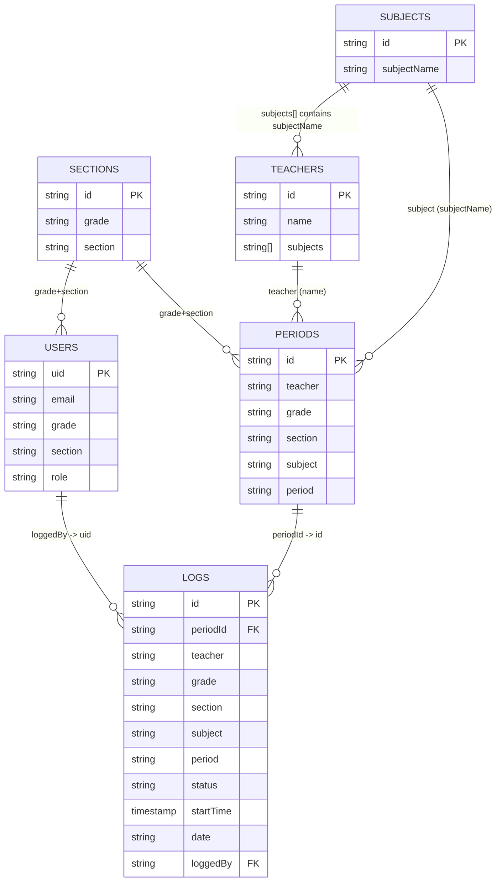
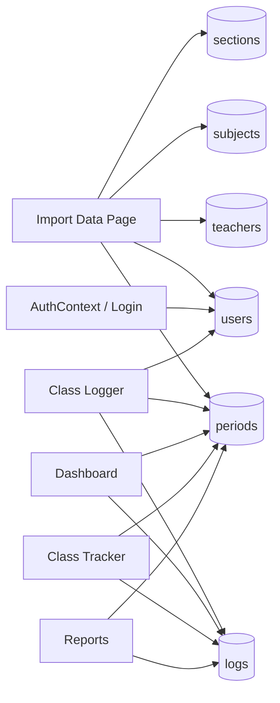

# Firestore Database Visualization

This diagram reflects the current Firestore model used by the app.

## 1) Entity Relationship View

## 2) Data Flow / Feature-to-Collection View

## 3) Relation Notes

- Firestore does not enforce foreign keys; these are application-level (soft) relations.
- `logs.periodId` references `periods/{id}`.
- `logs.loggedBy` references `users/{uid}`.
- `periods.teacher` and `periods.subject` are stored as strings (matching teacher name and subject name).
- `sections/{id}` uses `grade-section` format (example: `7-A`).
- `teachers/{id}` and `subjects/{id}` use name-based IDs.
